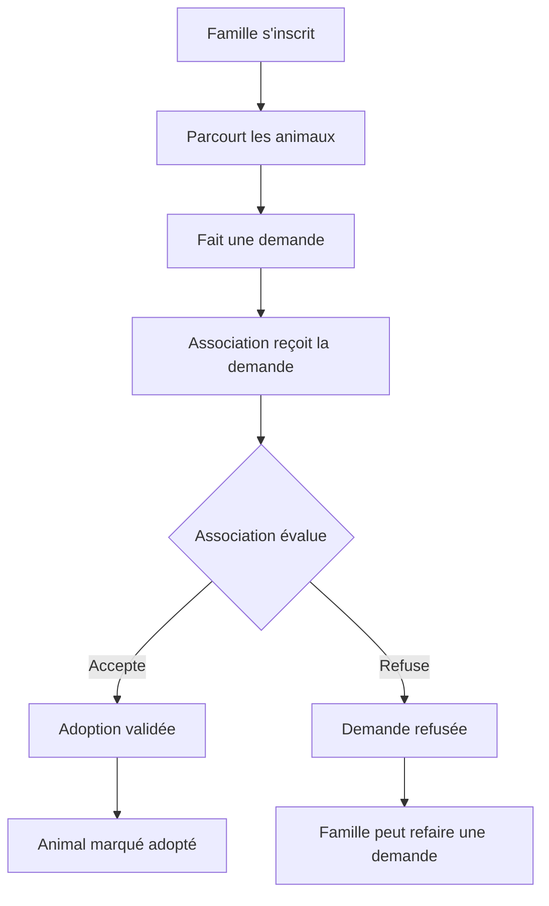
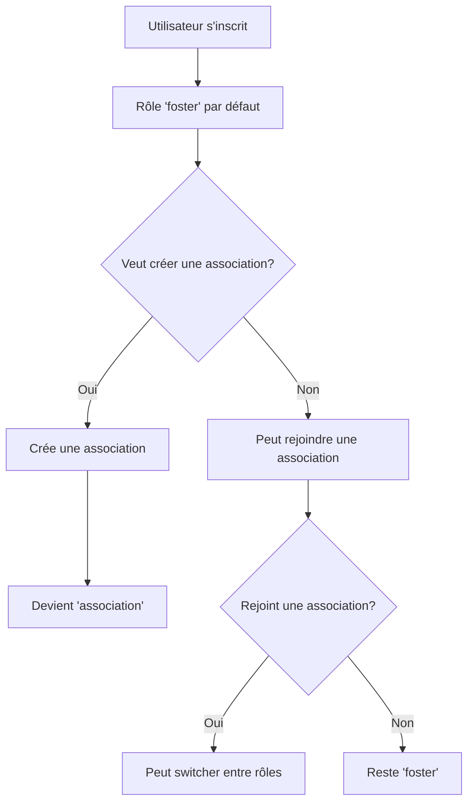

# 🐾 Backend Pet Foster Connect

Backend complet pour l'application Pet Foster Connect - Plateforme de mise en relation entre familles d'accueil et associations pour animaux.

## 📁 Structure du projet

```
backend/
├── src/
│   ├── config/           # Configuration de la base de données
│   │   ├── database.js   # Connexion Sequelize à PostgreSQL
│   │   └── swagger.js    # Configuration Swagger/OpenAPI
│   ├── controllers/      # Logique métier des endpoints (CRUD complet)
│   │   ├── authController.js      # Authentification (login, register, profile, switch-role)
│   │   ├── animalController.js    # Gestion des animaux (CRUD + filtres avancés)
│   │   ├── associationController.js # Gestion des associations (CRUD + membership)
│   │   ├── requestController.js   # Gestion des demandes d'accueil (workflow complet)
│   │   └── adminController.js     # Administration système (actions sensibles)
│   ├── middlewares/      # Middlewares Express (sécurité et validation)
│   │   ├── auth.js       # Authentification JWT + contrôle d'accès par rôles
│   │   ├── validation.js # Validation des données avec express-validator
│   │   └── errorHandler.js # Gestion centralisée des erreurs
│   ├── models/           # Modèles Sequelize (ORM) - Relations MPD conformes
│   │   ├── index.js      # Export et synchronisation des modèles
│   │   ├── Role.js       # Modèle des rôles utilisateur (foster/association/admin)
│   │   ├── User.js       # Modèle des utilisateurs avec associations
│   │   ├── Association.js # Modèle des associations avec validations
│   │   ├── Animal.js     # Modèle des animaux avec statuts et relations
│   │   └── Request.js    # Modèle des demandes avec workflow statuts
│   ├── routes/           # Définition des routes API REST
│   │   ├── index.js      # Routeur principal + health check
│   │   ├── auth.js       # Routes d'authentification & gestion utilisateurs
│   │   ├── animals.js    # Routes des animaux (CRUD complet)
│   │   ├── associations.js # Routes des associations (CRUD + membership)
│   │   ├── requests.js   # Routes des demandes d'accueil
│   │   └── admin.js      # Routes d'administration système
│   ├── database/         # Scripts SQL de base
│   │   ├── mpd.sql       # Structure de la base (MPD)
│   │   └── data.exemples.sql # Données d'exemple pour tests
│   └── index.js          # Point d'entrée de l'application
├── init/                 # Scripts d'initialisation Docker
│   ├── 01_mpd.sql        # Structure de base pour container
│   └── 02_data.exemples.sql # Données d'exemple pour container
├── .env.example          # Variables d'environnement exemple
├── package.json          # Dépendances et scripts npm
├── Dockerfile           # Configuration Docker
└── BACKEND.md           # Documentation technique (ce fichier)
```

## 🚀 Installation et démarrage

### Prérequis

- **Node.js** v18+
- **PostgreSQL** v14+
- **npm** ou **yarn**

### 1. Installation des dépendances

```bash
cd backend
npm install
```

### 2. Configuration de l'environnement

Créer le fichier `.env` à partir de l'exemple :

```bash
cp .env.example .env
```

Configurer les variables dans `.env` :

```env
# Base de données
DB_HOST=localhost
DB_PORT=5432
DB_NAME=petfosterconnect
DB_USER=petfosterconnect
DB_PASSWORD=your_password

# JWT
JWT_SECRET=your_super_secret_jwt_key
JWT_EXPIRES_IN=7d

# Application
PORT=3000
NODE_ENV=development
FRONTEND_URL=http://localhost:5173
```

### 3. Base de données PostgreSQL

```bash
# 1. Créer la base de données (si pas encore fait)
createdb petfosterconnect -U postgres

# 2. Créer la structure de la base
npm run db:create

# 3. Insérer les données d'exemple
npm run db:seed

# 4. Ou tout en une fois (reset complet)
npm run db:reset
```

### 4. Initialisation des rôles (IMPORTANT)

**Option 1 : Automatique via Sequelize (recommandé)**
Les rôles sont créés automatiquement au démarrage de l'application :

- `foster` : Famille d'accueil
- `association` : Membre d'association
- `admin` : Administrateur système

**Option 2 : Manuel via SQL**

```sql
-- Se connecter à PostgreSQL et exécuter :
INSERT INTO role (label) VALUES ('foster'), ('association'), ('admin');
```

### 5. Démarrage du serveur

```bash
# Mode développement (avec nodemon + hot reload)
npm run dev

# Mode production
npm start
```

### 6. Vérification du démarrage

Le serveur démarre sur `http://localhost:3000`

Endpoints de vérification :

- **API Health Check** : `GET http://localhost:3000/api/health`
- **Accueil API** : `GET http://localhost:3000/api`
- **Documentation Swagger** : `GET http://localhost:3000/api-docs` 📚

## 🛠 Technologies et dépendances

### Framework et outils principaux

- **Node.js** v18+ : Runtime JavaScript
- **Express.js** v4+ : Framework web minimaliste et robuste
- **Sequelize** v6+ : ORM pour PostgreSQL avec relations
- **PostgreSQL** v14+ : Base de données relationnelle performante

### Sécurité et authentification

- **JWT (jsonwebtoken)** : Authentification stateless sécurisée
- **Argon2** : Hashage sécurisé des mots de passe (recommandé OWASP)
- **CORS** : Contrôle d'accès cross-origin configuré
- **Helmet** : Sécurisation des headers HTTP

### Validation et middleware

- **Express-validator** : Validation robuste des données d'entrée
- **Express-rate-limit** : Protection contre le spam et brute force
- **dotenv** : Gestion sécurisée des variables d'environnement

### Documentation et développement

- **Swagger UI Express** : Documentation API interactive
- **Nodemon** : Hot reload en développement
- **ESLint** : Linting du code (configuration recommandée)

## 📡 API Endpoints (Documentation complète)

### 📚 Documentation interactive Swagger

La documentation complète de l'API est disponible via Swagger UI à l'adresse :
**http://localhost:3000/api-docs**

Cette interface permet de :

- ✅ **Visualiser** tous les endpoints disponibles avec exemples
- ✅ **Tester** directement les requêtes depuis le navigateur
- ✅ **Authentifier** avec JWT pour tester les endpoints privés
- ✅ **Comprendre** la structure des données et validations
- ✅ **Voir** les codes de réponse et formats d'erreur

### 🔐 Authentification (`/api/auth`)

| Méthode | Endpoint       | Description                           | Accès   | Body                                       |
| ------- | -------------- | ------------------------------------- | ------- | ------------------------------------------ |
| `GET`   | `/`            | Informations sur les endpoints auth   | Public  | -                                          |
| `POST`  | `/register`    | Inscription utilisateur (rôle foster) | Public  | `{email, password, first_name, last_name}` |
| `POST`  | `/login`       | Connexion utilisateur                 | Public  | `{email, password}`                        |
| `POST`  | `/logout`      | Déconnexion (invalidation token)      | Private | -                                          |
| `GET`   | `/profile`     | Profil utilisateur connecté           | Private | -                                          |
| `POST`  | `/switch-role` | Basculer entre rôles famille/asso     | Private | `{role: "foster"/"association"}`           |

### 🐾 Animaux (`/api/animals`)

| Méthode  | Endpoint | Description                 | Accès                      | Paramètres/Body                                       |
| -------- | -------- | --------------------------- | -------------------------- | ----------------------------------------------------- |
| `GET`    | `/`      | Liste des animaux + filtres | Public                     | `?search, species, status, page, limit`               |
| `GET`    | `/:id`   | Détails d'un animal         | Public                     | -                                                     |
| `POST`   | `/`      | Créer un animal             | Association                | `{name, species, breed, age, description, photo_url}` |
| `PATCH`  | `/:id`   | Modifier un animal          | Association (propriétaire) | `{champs à modifier}`                                 |
| `DELETE` | `/:id`   | Supprimer un animal         | Association (propriétaire) | -                                                     |

### 🏢 Associations (`/api/associations`)

| Méthode  | Endpoint    | Description                          | Accès                      | Paramètres/Body                 |
| -------- | ----------- | ------------------------------------ | -------------------------- | ------------------------------- |
| `GET`    | `/`         | Liste des associations + pagination  | Public                     | `?search, page, limit`          |
| `GET`    | `/:id`      | Détails d'une association            | Public                     | -                               |
| `POST`   | `/create`   | Créer une association + rattachement | Authentifié                | `{name, email, phone, address}` |
| `POST`   | `/:id/join` | Rejoindre une association existante  | Authentifié                | -                               |
| `POST`   | `/leave`    | Quitter l'association actuelle       | Authentifié                | -                               |
| `PATCH`  | `/:id`      | Modifier une association             | Association (propriétaire) | `{name, email, phone, address}` |
| `DELETE` | `/:id`      | Supprimer une association            | Admin uniquement           | -                               |

### 📩 Demandes d'accueil (`/api/requests`)

| Méthode | Endpoint    | Description             | Accès       | Paramètres/Body                                     |
| ------- | ----------- | ----------------------- | ----------- | --------------------------------------------------- |
| `POST`  | `/`         | Créer une demande       | Foster      | `{id_animal, message}`                              |
| `GET`   | `/user`     | Mes demandes envoyées   | Foster      | `?status`                                           |
| `GET`   | `/received` | Demandes reçues         | Association | `?status, animal_id`                                |
| `GET`   | `/:id`      | Détails d'une demande   | Owner/Asso  | -                                                   |
| `PATCH` | `/:id`      | Modifier statut demande | Association | `{status: "accepted"/"rejected", response_message}` |

### 👮 Administration (`/api/admin`)

| Méthode  | Endpoint            | Description                            | Accès |
| -------- | ------------------- | -------------------------------------- | ----- |
| `DELETE` | `/users/:id`        | Supprimer un utilisateur (RGPD)        | Admin |
| `DELETE` | `/associations/:id` | Supprimer une association (modération) | Admin |
| `DELETE` | `/animals/:id`      | Supprimer un animal (modération)       | Admin |

### 🔧 Utilitaires

| Méthode | Endpoint  | Description                     | Accès  |
| ------- | --------- | ------------------------------- | ------ |
| `GET`   | `/health` | Status de l'API (monitoring)    | Public |
| `GET`   | `/`       | Accueil API avec tous endpoints | Public |

## 🔒 Sécurité et bonnes pratiques

### Authentification et autorisation

- **JWT avec Bearer Token** : `Authorization: Bearer <token>`
- **Expiration configurable** : 7 jours par défaut (configurable via JWT_EXPIRES_IN)
- **Middleware d'authentification** : Vérification automatique des tokens
- **Contrôle d'accès par rôles** : foster/association/admin avec middleware `requireRole()`
- **Validation des permissions** : Vérification automatique de propriété des ressources

### Protection des données

- **Argon2** : Hashage des mots de passe (recommandé OWASP, résistant GPU)
- **Express-validator** : Validation stricte de toutes les entrées utilisateur
- **Sanitisation automatique** : Nettoyage des données avant insertion en base
- **CORS configuré** : Autorisation uniquement du frontend défini
- **Rate limiting** : Protection contre le spam et attaques brute force
- **Helmet** : Sécurisation des headers HTTP contre les attaques communes

### Gestion des erreurs

- **Middleware centralisé** : Gestion uniforme des erreurs dans errorHandler.js
- **Logs structurés** : Traçabilité complète pour debugging et audit
- **Codes de statut HTTP appropriés** : 200, 201, 400, 401, 403, 404, 500
- **Messages d'erreur sécurisés** : Pas de fuite d'informations sensibles
- **Format d'erreur standardisé** : Structure JSON cohérente

### Base de données et intégrité

- **Relations avec contraintes** : Foreign keys, NOT NULL, UNIQUE
- **Validation au niveau ORM** : Sequelize avec règles métier intégrées
- **Transactions automatiques** : Pour les opérations critiques multi-tables
- **Indexes optimisés** : Sur les champs de recherche fréquents
- **Cascade configurée** : Suppression intelligente des données liées

### Conformité RGPD

- **Droit à l'effacement** : Endpoint admin pour suppression complète des données
- **Minimisation des données** : Collecte uniquement des informations nécessaires
- **Traçabilité des suppressions** : Logs des actions administratives
- **Consentement explicite** : Validation des conditions d'utilisation

## 🧪 Tests et développement

### Scripts npm disponibles

```bash
npm run dev          # Démarrage développement (nodemon + hot reload)
npm start           # Démarrage production
npm run db:create   # Création structure DB (via scripts SQL)
npm run db:seed     # Insertion données de test
npm run db:reset    # Reset complet de la DB
npm run lint        # Vérification du code (ESLint)
npm test            # Exécution des tests (si configurés)
```

### Variables d'environnement essentielles

```env
# Base de données PostgreSQL
DB_HOST=localhost
DB_PORT=5432
DB_NAME=petfosterconnect
DB_USER=petfosterconnect_user
DB_PASSWORD=your_secure_password

# JWT Configuration
JWT_SECRET=your_super_secret_jwt_key_256_bits_minimum
JWT_EXPIRES_IN=7d

# Application
PORT=3000
NODE_ENV=development
FRONTEND_URL=http://localhost:5173

# Sécurité (optionnel)
RATE_LIMIT_WINDOW_MS=900000  # 15 minutes
RATE_LIMIT_MAX_REQUESTS=100  # Requêtes par fenêtre
```

### Workflows de développement

#### Développement d'une nouvelle fonctionnalité :

1. **Modèle** : Créer/modifier le modèle Sequelize dans `src/models/`
2. **Contrôleur** : Ajouter la logique métier dans `src/controllers/`
3. **Validation** : Ajouter les règles dans `src/middlewares/validation.js`
4. **Routes** : Définir les endpoints dans `src/routes/`
5. **Documentation** : Ajouter les annotations Swagger
6. **Tests** : Tester via Swagger UI ou Postman

#### Exemples d'utilisation complets

**1. Inscription d'une famille d'accueil :**

```bash
curl -X POST http://localhost:3000/api/auth/register \
  -H "Content-Type: application/json" \
  -d '{
    "email": "famille@test.com",
    "password": "MotDePasse123!",
    "first_name": "Jean",
    "last_name": "Dupont"
  }'
```

**2. Connexion et récupération du token :**

```bash
curl -X POST http://localhost:3000/api/auth/login \
  -H "Content-Type: application/json" \
  -d '{
    "email": "famille@test.com",
    "password": "MotDePasse123!"
  }'
```

**3. Création d'une association (avec token) :**

```bash
curl -X POST http://localhost:3000/api/associations/create \
  -H "Content-Type: application/json" \
  -H "Authorization: Bearer YOUR_JWT_TOKEN" \
  -d '{
    "name": "SPA de Paris",
    "email": "contact@spa-paris.fr",
    "phone": "0123456789",
    "address": "123 Rue de la Paix, 75001 Paris"
  }'
```

**4. Ajout d'un animal (en tant qu'association) :**

```bash
curl -X POST http://localhost:3000/api/animals \
  -H "Content-Type: application/json" \
  -H "Authorization: Bearer YOUR_JWT_TOKEN" \
  -d '{
    "name": "Rex",
    "species": "Chien",
    "breed": "Berger Allemand",
    "age": 5,
    "description": "Chien très gentil et protecteur",
    "photo_url": "https://example.com/rex.jpg",
    "id_association": 1
  }'
```

**5. Recherche d'animaux avec filtres :**

```bash
curl -X GET "http://localhost:3000/api/animals?search=Rex&species=Chien&status=disponible&page=1&limit=10"
```

**6. Création d'une demande d'accueil (famille) :**

```bash
curl -X POST http://localhost:3000/api/requests \
  -H "Content-Type: application/json" \
  -H "Authorization: Bearer YOUR_JWT_TOKEN" \
  -d '{
    "id_animal": 1,
    "message": "Nous souhaitons adopter Rex car nous avons beaucoup d'expérience avec les chiens."
  }'
```

### Debugging et monitoring

- **Logs structurés** : Utilisez `console.log()` avec préfixes pour identifier les sources
- **Health check** : `GET /api/health` pour vérifier l'état de l'API
- **Swagger UI** : Interface complète pour tester tous les endpoints
- **Codes d'erreur explicites** : Chaque erreur a un code et message explicite
- **Monitoring base de données** : Vérifiez les connexions avec `npm run db:test`

## 📚 Pour les étudiants CDA (Concepteur Développeur d'Applications)

### Concepts techniques illustrés

1. **Architecture MVC avancée** (Model-View-Controller)

   - **Models** : Couche de données avec Sequelize ORM et relations complexes
   - **Controllers** : Logique métier avec gestion d'erreurs et validation
   - **Routes** : Interface API RESTful avec middleware de sécurité
   - **Middlewares** : Couche transversale pour authentification, validation, erreurs

2. **API REST complète** avec Express.js

   - **Verbes HTTP** appropriés (GET, POST, PATCH, DELETE) selon les opérations
   - **Codes de statut** standardisés (200, 201, 400, 401, 403, 404, 500)
   - **Structure JSON** cohérente pour toutes les réponses
   - **Pagination** native pour optimiser les performances
   - **Filtrage avancé** avec paramètres de requête

3. **ORM avec Sequelize avancé**

   - **Modèles** avec relations complexes (belongsTo, hasMany, belongsToMany)
   - **Migrations** automatiques et synchronisation
   - **Requêtes** optimisées avec jointures et inclusions
   - **Validations** au niveau modèle avec contraintes métier
   - **Hooks** pour automatiser les traitements (beforeCreate, afterUpdate)

4. **Authentification JWT sécurisée**

   - **Stateless authentication** (pas de sessions serveur)
   - **Middleware** de vérification avec gestion d'erreurs
   - **Autorisation** basée sur les rôles (RBAC)
   - **Switch de rôles** dynamique pour utilisateurs multi-casquettes
   - **Refresh token** (préparé pour évolution future)

5. **Validation robuste des données**

   - **express-validator** avec règles métier complexes
   - **Sanitisation** automatique des entrées utilisateur
   - **Messages d'erreur** localisés et informatifs
   - **Validation en cascade** (modèle + contrôleur + base)

6. **Gestion avancée des erreurs**

   - **Try-catch** systématique dans les controllers
   - **Middleware centralisé** pour formatage des erreurs
   - **Logging** structuré pour debugging et audit
   - **Codes d'erreur** métier pour le frontend

7. **Relations de base de données complexes**

   - **Clés étrangères** avec contraintes d'intégrité
   - **Relations 1:N** : User→Association, Association→Animal, User→Request
   - **Relations N:M** : Préparées pour évolutions (tags, favoris)
   - **Cascade** intelligente pour suppression en chaîne
   - **Indexes** optimisés pour performances

8. **Middlewares Express avancés**

   - **Pipeline de traitement** avec ordre d'exécution maîtrisé
   - **Authentification** et **autorisation** modulaires
   - **Rate limiting** pour protection anti-spam
   - **CORS** configuré pour sécurité cross-origin
   - **Compression** pour optimiser les transferts

9. **Documentation automatique**

   - **Swagger/OpenAPI** généré depuis le code
   - **Annotations** inline pour maintenir la cohérence
   - **Interface interactive** pour tests en temps réel
   - **Exemples complets** pour chaque endpoint

10. **Sécurité OWASP**
    - **Injection SQL** : Prévention via ORM paramétré
    - **XSS** : Sanitisation automatique des entrées
    - **CSRF** : Protection via tokens stateless
    - **Broken Authentication** : JWT sécurisé + Argon2
    - **Security Headers** : Helmet configuré

### Bonnes pratiques appliquées

- ✅ **Séparation des responsabilités** : Chaque couche a un rôle défini
- ✅ **Configuration externalisée** : Variables d'environnement pour tous les paramètres
- ✅ **Gestion d'erreurs centralisée** : Cohérence dans toute l'application
- ✅ **Validation stricte multi-niveaux** : Sécurité en profondeur
- ✅ **Sécurité des mots de passe** : Argon2 résistant aux attaques GPU
- ✅ **API RESTful** cohérente : Conventions respectées
- ✅ **Documentation code** automatique : Swagger généré
- ✅ **Structure modulaire** évolutive : Ajout facile de fonctionnalités
- ✅ **Performance optimisée** : Pagination, indexes, requêtes optimisées
- ✅ **Monitoring intégré** : Health checks et logs structurés

### Workflows métier implémentés

#### 1. Workflow d'adoption complète



#### 2. Gestion des rôles utilisateur



### Points d'amélioration possibles (exercices avancés)

#### Niveau intermédiaire :

- 📋 **Tests unitaires** avec Jest + Supertest
- 📋 **Rate limiting** avancé par utilisateur
- 📋 **Upload de fichiers** avec validation et redimensionnement
- 📋 **Recherche full-text** avec PostgreSQL
- 📋 **Notifications email** avec templates

#### Niveau avancé :

- 📋 **Cache Redis** pour performances
- 📋 **WebSockets** pour notifications temps réel
- 📋 **Monitoring** avec métriques Prometheus
- 📋 **CI/CD** avec tests automatisés
- 📋 **Elasticsearch** pour recherche complexe
- 📋 **Microservices** pour scalabilité

#### Niveau expert :

- 📋 **Event Sourcing** pour audit complet
- 📋 **CQRS** pour séparation lecture/écriture
- 📋 **GraphQL** comme alternative REST
- 📋 **Kubernetes** pour orchestration
- 📋 **Observability** complète (logs, metrics, traces)

### Compétences CDA validées

#### CP2 - Développer des interfaces utilisateur web

- ✅ API REST complète et documentée
- ✅ Formats de données standardisés
- ✅ Gestion des erreurs utilisateur

#### CP3 - Développer des composants métier

- ✅ Logique métier dans les contrôleurs
- ✅ Validation des règles business
- ✅ Workflows complexes implémentés

#### CP8 - Développer des composants d'accès aux données

- ✅ ORM avec relations complexes
- ✅ Optimisation des requêtes
- ✅ Gestion des transactions

#### CP9 - Préparer et exécuter tests

- ✅ Endpoints documentés et testables
- ✅ Swagger UI pour tests interactifs
- ✅ Jeux de données de test

Cette implémentation backend constitue un **exemple complet** et **professionnel** d'API REST pour une application métier complexe, respectant les standards de l'industrie et les exigences du référentiel CDA ! 🎯

---

## 🚀 Évolutions futures planifiées

### Court terme (Sprint suivant)

- 📧 **Notifications email** : Alertes sur changement de statut des demandes
- 🖼️ **Upload photos** : Gestion des images d'animaux avec redimensionnement
- � **Recherche avancée** : Filtres géographiques et critères multiples

### Moyen terme

- 💬 **Messagerie interne** : Communication directe famille/association
- � **Tableau de bord** : Statistiques pour les associations
- 🔔 **Notifications push** : Alertes temps réel

### Long terme

- 🌍 **API publique** : Intégration avec d'autres plateformes
- 🤖 **IA** : Matching automatique famille/animal
- 📱 **Application mobile** : Extension de la plateforme

**Cette architecture solide permet toutes ces évolutions ! 🌟**
